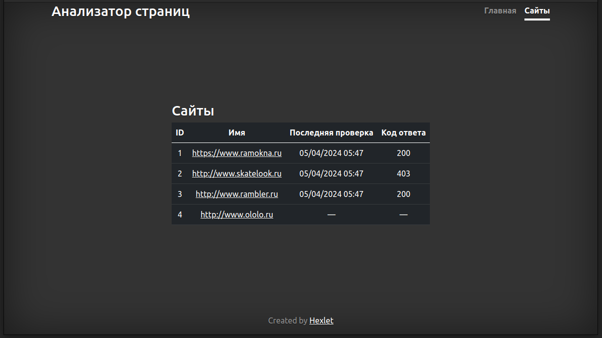
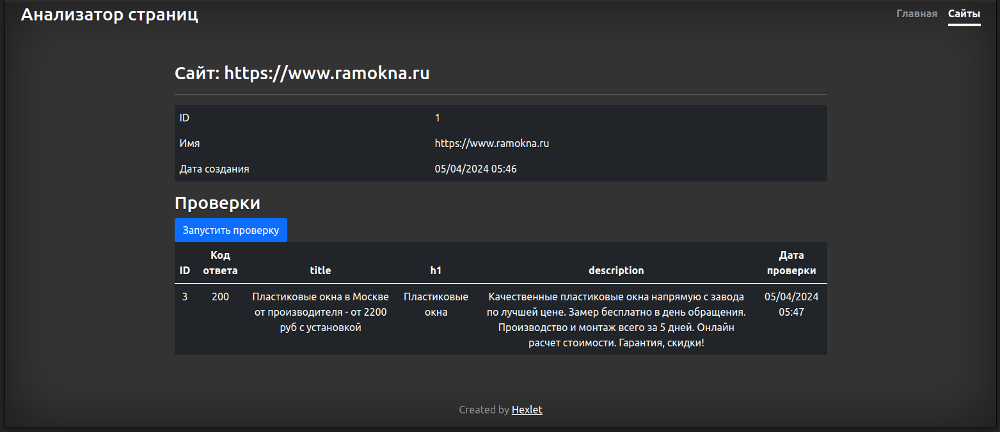

# PAGE SEO-ANALYZER

### [tests, linter status and maintainability]

## [demo version]:
https://pageanalyzerjavalin.onrender.com

## [useful features]
1. checking website for availability
2. scanning the specified page of website for seo-suitability (tags: h1, title and description)
3. report generation

## [how it works]
1. launch the web service Page Analyzer
2. type the name of the website in according with requirements and push the Enter
3. information page about website will open
4. push the "Проверить" (launch checking)
5. see result of checking at the table below
6. enjoy)

## [page analyzer example]

## [technical stack]
**backend**: java, javalin, PostgresQL

**frontend**: jte template, bootstrap and css

**tooling**: lombok, unirest, jsoup, jacoco, checkstyle, mockwebserver, assertj 

**deploy**: PaaS on render.com
